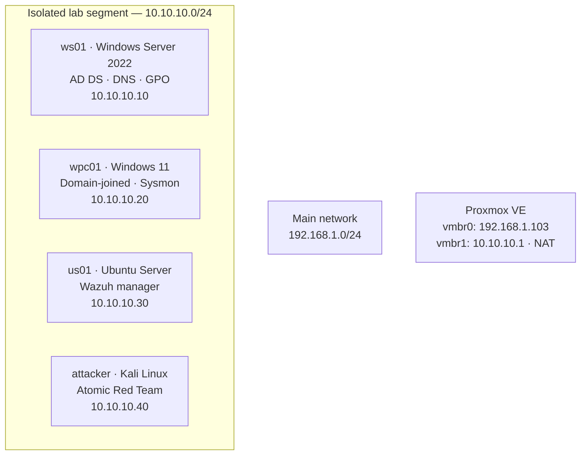

```mermaid
graph TB
    NET["Main network<br/>192.168.1.0/24"]
    PVE["Proxmox VE<br/>vmbr0: 192.168.1.103<br/>vmbr1: 10.10.10.1 · NAT"]

    subgraph LAB["Isolated lab segment — 10.10.10.0/24"]
        DC["ws01 · Windows Server 2022<br/>AD DS · DNS · GPO<br/>10.10.10.10"]
        WS["wpc01 · Windows 11<br/>Domain-joined · Sysmon<br/>10.10.10.20"]
        SIEM["us01 · Ubuntu Server<br/>Wazuh manager<br/>10.10.10.30"]
        ATK["attacker · Kali Linux<br/>Atomic Red Team<br/>10.10.10.40"]
    end
```
